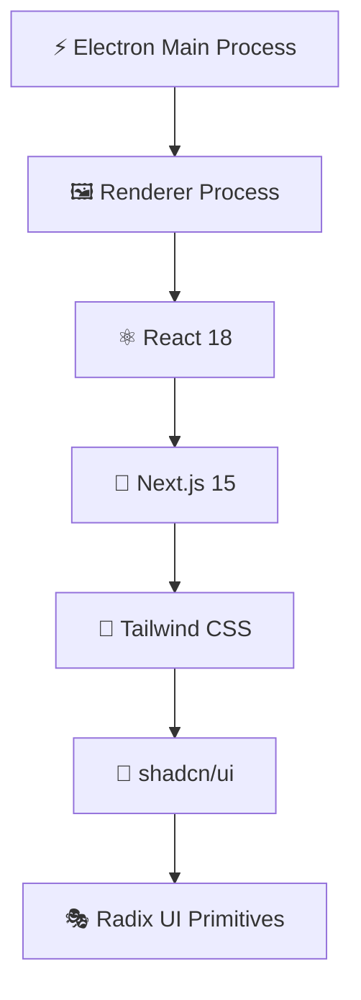

# 🚀 APIONIX V.2 - Advanced API Development Platform

<div align="center">
  
  
  [](https://github.com/your-username/apionix-v2)
  [](LICENSE)
  [](https://electronjs.org/)
  [](https://nextjs.org/)
  [](https://reactjs.org/)
  [](https://www.typescriptlang.org/)

  *A powerful, modern desktop application for API development and testing built with cutting-edge technologies*
</div>

---

## 🎯 Overview

APIONIX V.2 is a comprehensive API development platform that combines the power of Electron.js with the modern React ecosystem. Designed for developers who demand efficiency, reliability, and a beautiful user interface for their API testing workflows.

### ✨ Key Highlights

- 🖥️ **Native Desktop Experience** - Built with Electron for cross-platform compatibility
- 🌐 **Modern Web Technologies** - Powered by Next.js 15 with App Router
- 🎨 **Beautiful UI** - Crafted with Tailwind CSS and shadcn/ui components
- 🔄 **Real-time Features** - Live API testing with instant feedback
- 📱 **Responsive Design** - Adaptive interface that works on any screen size
- 🌙 **Dark/Light Mode** - System-aware theme switching
- 🔒 **Secure** - Multiple authentication methods support

---

## 🎨 User Interface Features

### 🎭 Design System

Our UI is built on a comprehensive design system that ensures consistency and accessibility:

- **Design Framework**: [shadcn/ui](https://ui.shadcn.com/) components
- **Styling**: Tailwind CSS with custom design tokens
- **Icons**: Lucide React icon library
- **Typography**: Space Grotesk font family
- **Color Palette**: Carefully crafted dark/light themes
- **Animations**: Smooth transitions and micro-interactions

### 🧩 Core UI Components

#### 📋 Request Interface
```
┌─────────────────────────────────────────────────────────┐
│ 🔍 METHOD SELECTOR │ 🌐 URL INPUT BAR │ ▶️ SEND BUTTON │
├─────────────────────────────────────────────────────────┤
│ 📑 TABS: Body | Headers | Auth | Query Params           │
├─────────────────────────────────────────────────────────┤
│ 📝 REQUEST BODY EDITOR (JSON with syntax highlighting)   │
│ 🔧 JSON ERROR DETECTION & AUTO-FIX SUGGESTIONS         │
└─────────────────────────────────────────────────────────┘
```

#### 📊 Response Viewer
```
┌─────────────────────────────────────────────────────────┐
│ ✅ STATUS │ ⏱️ TIME │ 📏 SIZE │ 🔄 RESPONSE TABS        │
├─────────────────────────────────────────────────────────┤
│ 📋 Response Body (Formatted JSON/XML/Text)              │
│ 📑 Headers Information                                   │
│ 🍪 Cookies Details                                      │
└─────────────────────────────────────────────────────────┘
```

#### 🔐 Authentication Panel
```
┌─────────────────────────────────────────────────────────┐
│ 🎯 AUTH TYPE SELECTOR                                   │
│ ├─ 🔑 Bearer Token                                      │
│ ├─ 👤 Basic Auth                                        │
│ └─ 🗝️ API Key                                          │
├─────────────────────────────────────────────────────────┤
│ 📝 Dynamic Input Fields Based on Auth Type             │
│ 👁️ Show/Hide Sensitive Information Toggle              │
│ ✅ Authentication Status Indicator                      │
└─────────────────────────────────────────────────────────┘
```

### 🎪 Interactive Elements

#### 🏷️ Tab Management
- ➕ **Add New Tab** - Create multiple request tabs
- 🗑️ **Close Tab** - Remove unwanted tabs
- 🔄 **Tab Switching** - Quick navigation between requests
- 💾 **Auto-save** - Persistent tab state across sessions

#### 🎚️ Resizable Panels
- 📐 **Split Layout** - Adjustable request/response panels
- 🔧 **Customizable** - Remember user preferences
- 📱 **Responsive** - Adapt to different screen sizes

#### 🎨 Theme System
- 🌞 **Light Mode** - Clean, bright interface
- 🌙 **Dark Mode** - Easy on the eyes
- 🖥️ **System Theme** - Automatic OS theme detection
- 🎯 **Instant Switching** - Seamless theme transitions

---

## 🛠️ Technology Stack

### 🏗️ Frontend Architecture



#### Core Technologies
- **🖥️ Electron**: `28.2.8` - Cross-platform desktop framework
- **⚛️ React**: `18.3.1` - Modern UI library
- **🔄 Next.js**: `15.2.4` - Full-stack React framework
- **📘 TypeScript**: `5.x` - Type-safe development
- **🎨 Tailwind CSS**: `3.4.17` - Utility-first CSS framework

#### UI Component Library
- **🧩 Radix UI**: Unstyled, accessible components
  - `@radix-ui/react-dialog` - Modal dialogs
  - `@radix-ui/react-dropdown-menu` - Dropdown menus
  - `@radix-ui/react-tabs` - Tab navigation
  - `@radix-ui/react-toast` - Notifications
  - `@radix-ui/react-tooltip` - Helpful tooltips
  - And 20+ more components

#### Styling & Design
- **🎨 Tailwind CSS**: Responsive design system
- **🎭 shadcn/ui**: Pre-built component library
- **🔧 Class Variance Authority**: Component variants
- **✨ Tailwind Animate**: Smooth animations
- **🎯 Tailwind Merge**: Intelligent class merging

#### Icons & Assets
- **🎨 Lucide React**: `^0.454.0` - Beautiful icon library
- **🖼️ Custom Icons**: Project-specific iconography

---

## 🚀 Getting Started

### 📋 Prerequisites

Ensure you have the following installed:

- **Node.js** `18+` 📦
- **npm** or **yarn** 🧶
- **Git** 🔧

### 🔧 Installation

1. **📥 Clone the Repository**
   ```bash
   git clone https://github.com/your-username/apionix-v2.git
   cd apionix-v2
   ```

2. **📦 Install Dependencies**
   ```bash
   npm install
   ```

3. **🏃‍♂️ Start Development**
   ```bash
   npm run dev
   ```

4. **🎉 Ready!**
   The application will open automatically in a new Electron window.

### 🏗️ Build Scripts

```bash
# 🔧 Development Mode (Hot Reload)
npm run dev

# 🏗️ Build for Production
npm run build

# 📦 Package for Distribution
npm run package

# ▶️ Start Production Build
npm run start
```

---

## 🎨 UI Components Showcase

### 🎯 Primary Actions

#### ▶️ Send Button
```tsx
<button className="
  bg-[#73DC8C] hover:bg-[#66c97f] 
  text-black text-xs px-2 py-1 
  rounded-md shadow-[0_0_5px_rgba(115,220,140,0.2)]
  transition-all duration-200
">
  Send
</button>
```

#### 🎚️ Method Selector
```tsx
<select className="
  bg-transparent text-white text-xs
  border border-gray-600/20 rounded-md
  hover:border-[#4B78E6]/50
  focus:outline-none
">
  <option>GET</option>
  <option>POST</option>
  <option>PUT</option>
  <!-- More methods -->
</select>
```

### 🎨 Interactive Elements

#### 📑 Tab Component
- **Active State**: Highlighted background with blue accent
- **Hover Effects**: Subtle color transitions
- **Close Button**: X icon with hover animation
- **Status Indicators**: Method badges (GET, POST, etc.)

#### 🔍 JSON Editor
- **Syntax Highlighting**: Color-coded JSON structure
- **Error Detection**: Red underlines for syntax errors
- **Auto-suggestions**: Smart fixes for common issues
- **Line Numbers**: Easy navigation and debugging

---

## 🎪 Advanced Features

### 🧠 Smart JSON Handling

Our JSON editor includes intelligent features:

```javascript
// 🔧 Auto-fix common JSON issues
const fixes = [
  { pattern: /(\w+)(\s*):/g, replacement: '"$1"$2:' },
  { pattern: /'/g, replacement: '"' },
  { pattern: /,(\s*[}\]])/g, replacement: "$1" },
  // More smart fixes...
];
```

### 🎯 Authentication System

#### 🔑 Bearer Token
```
┌─────────────────────────────────────┐
│ 🔑 Token: [••••••••••••••••••••••] 👁️│
│ ✅ Will be sent as: Authorization:  │
│    Bearer token...                  │
└─────────────────────────────────────┘
```

#### 👤 Basic Authentication
```
┌─────────────────────────────────────┐
│ 👤 Username: [admin]                │
│ 🔒 Password: [••••••••••••] 👁️      │
│ ✅ Credentials: Basic YWRtaW46...   │
└─────────────────────────────────────┘
```

#### 🗝️ API Key
```
┌─────────────────────────────────────┐
│ 🏷️ Header Name: [X-API-Key]        │
│ 🗝️ Key Value: [••••••••••••] 👁️    │
│ ✅ Header: X-API-Key: ●●●●●●●●      │
└─────────────────────────────────────┘
```

### 📊 Response Analysis

#### 📈 Performance Metrics
- ⏱️ **Response Time**: Millisecond precision
- 📏 **Content Size**: Bytes and KB display
- 🔢 **Status Code**: Color-coded indicators
- 📋 **Headers Count**: Complete header analysis

#### 🎨 Status Indicators
- ✅ **200-299**: Green (Success)
- ⚠️ **300-399**: Yellow (Redirect)
- ❌ **400-499**: Orange (Client Error)
- 🔥 **500-599**: Red (Server Error)

---

## 🎨 Theming & Customization

### 🌈 Color System

```css
:root {
  /* 🎨 Primary Colors */
  --primary: #4B78E6;
  --success: #73DC8C;
  --warning: #F59E0B;
  --error: #EF4444;
  
  /* 🌫️ Neutral Colors */
  --background: #0a0a0a;
  --foreground: #ffffff;
  --muted: rgba(255, 255, 255, 0.1);
  
  /* 🎯 Accent Colors */
  --accent: #1a1a1a;
  --border: rgba(255, 255, 255, 0.1);
}
```

### 🎭 Theme Variables

#### 🌙 Dark Theme
```css
.dark {
  --background: 10 10 10;
  --foreground: 255 255 255;
  --card: 26 26 26;
  --card-foreground: 255 255 255;
  /* More dark theme variables */
}
```

#### 🌞 Light Theme
```css
.light {
  --background: 255 255 255;
  --foreground: 10 10 10;
  --card: 250 250 250;
  --card-foreground: 10 10 10;
  /* More light theme variables */
}
```

---

## 📱 Responsive Design

### 🖥️ Desktop Layout
```
┌─────────────────────────────────────────────────────┐
│ 🎯 TITLE BAR                                        │
├─────────────────────────────────────────────────────┤
│ 📑 TAB BAR                                          │
├─────────────────────┬───────────────────────────────┤
│ 📤 REQUEST PANEL    │ 📥 RESPONSE PANEL             │
│                     │                               │
│ Method & URL        │ Status & Timing               │
│ Headers & Body      │ Response Body                 │
│ Auth Settings       │ Headers & Cookies             │
│                     │                               │
└─────────────────────┴───────────────────────────────┘
```

### 📱 Mobile-Friendly Adaptations
- **🔄 Vertical Stacking**: Panels stack vertically on small screens
- **📱 Touch-Friendly**: Larger touch targets for mobile
- **📐 Responsive Grids**: Adaptive layouts for different sizes
- **🎚️ Collapsible Sections**: Expandable UI elements

---

## 🔧 Configuration

### ⚙️ Application Settings

```typescript
interface AppSettings {
  theme: 'light' | 'dark' | 'system';
  fontSize: 'small' | 'medium' | 'large';
  autoSave: boolean;
  notifications: boolean;
  shortcuts: Record<string, string>;
}
```

### 🎨 UI Preferences

```typescript
interface UIPreferences {
  panelLayout: 'horizontal' | 'vertical';
  sidebarWidth: number;
  showLineNumbers: boolean;
  wordWrap: boolean;
  minimap: boolean;
}
```

---

## 🚀 Performance Optimizations

### ⚡ Fast Rendering
- **🔄 Virtual Scrolling**: Efficient list rendering
- **📝 Code Splitting**: Lazy-loaded components
- **🎯 Memoization**: Optimized re-renders
- **📦 Bundle Size**: Minimized JavaScript bundles

### 💾 Memory Management
- **🧹 Cleanup**: Proper component unmounting
- **📊 Monitoring**: Memory usage tracking
- **🔄 Garbage Collection**: Efficient memory disposal

---

## 🎯 Accessibility Features

### ♿ ARIA Support
- **🏷️ Labels**: Proper ARIA labels on all interactive elements
- **🎯 Focus Management**: Keyboard navigation support
- **📢 Screen Readers**: Compatible with assistive technologies
- **🔍 High Contrast**: Support for high contrast modes

### ⌨️ Keyboard Shortcuts
- **⌘/Ctrl + N**: New Tab
- **⌘/Ctrl + W**: Close Tab
- **⌘/Ctrl + Enter**: Send Request
- **⌘/Ctrl + ,**: Open Settings
- **F11**: Toggle Fullscreen

---

## 🎨 UI Guidelines

### 🎯 Design Principles

1. **🎨 Consistency**: Uniform component behavior across the app
2. **⚡ Performance**: Smooth animations and interactions
3. **♿ Accessibility**: Inclusive design for all users
4. **📱 Responsiveness**: Adaptive to all screen sizes
5. **🎭 Aesthetics**: Beautiful and modern interface

### 🧩 Component Standards

#### ✅ Do's
- Use consistent spacing (4px grid system)
- Implement proper loading states
- Provide clear error messages
- Support both light and dark themes
- Include hover and focus states

#### ❌ Don'ts
- Don't use hardcoded colors
- Avoid blocking UI interactions
- Don't skip loading indicators
- Avoid inconsistent spacing
- Don't ignore accessibility

---

## 🔮 Roadmap

### 🎯 Upcoming UI Features

- **🎨 Custom Themes**: User-created color schemes
- **📊 Advanced Charts**: Request analytics visualization
- **🔍 Global Search**: Quick find across all requests
- **📝 Rich Text Editor**: Enhanced request documentation
- **🎪 Workflow Builder**: Visual API testing flows

### 🚀 Performance Improvements

- **⚡ Faster Startup**: Reduced app launch time
- **💾 Better Caching**: Smarter request/response caching
- **🎯 Optimized Rendering**: Even smoother animations
- **📦 Smaller Bundles**: Reduced download size

---

## 🤝 Contributing

We welcome contributions! Please see our [Contributing Guide](CONTRIBUTING.md) for details.

### 🎨 UI Contributions

When contributing to UI components:

1. **🎯 Follow Design System**: Use existing Tailwind classes
2. **♿ Ensure Accessibility**: Include ARIA labels and keyboard support
3. **📱 Test Responsiveness**: Verify on different screen sizes
4. **🎭 Support Themes**: Test in both light and dark modes
5. **📚 Document Changes**: Update component documentation

---

## 📄 License

This project is licensed under the MIT License - see the [LICENSE](LICENSE) file for details.

---

## 🙏 Acknowledgments

- **🎨 shadcn/ui** - For the beautiful component library
- **🎭 Radix UI** - For accessible primitives
- **🎯 Tailwind CSS** - For the utility-first CSS framework
- **⚛️ React Team** - For the amazing framework
- **🔄 Next.js Team** - For the powerful full-stack framework

---

<div align="center">
  <h3>Made with ❤️ by the APIONIX Team</h3>
  
  [](https://github.com/your-username/apionix-v2/stargazers)
  [](https://github.com/your-username/apionix-v2/network/members)
  [](https://github.com/your-username/apionix-v2/watchers)
</div>